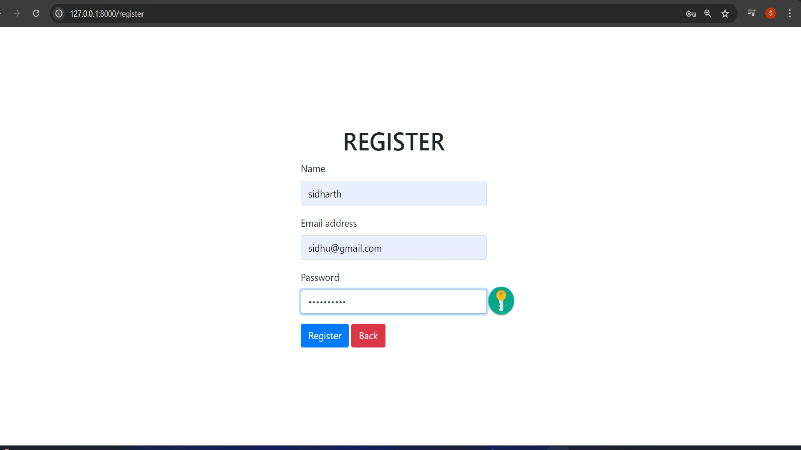
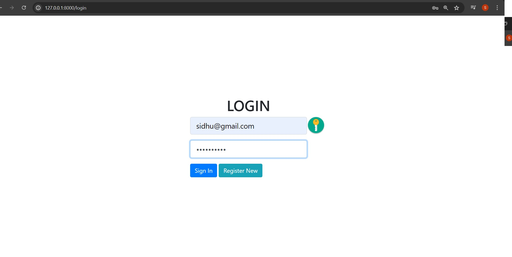
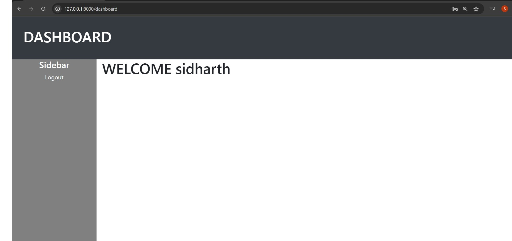

# BASIC-AUTHENTICATION-SYSTEM
User registration, login, and logout functionality using Laravel's built-in authentication system and Generate a unique alphanumeric user ID for each registered user upon registration.
</br>
## Register page 
- 
</br>

## Login page 
- 
</br>

## Dashboard page 
- 
</br>

## unique alphanumeric user ID
<p style="font-weight: bold;">
Here I used md5(time()) to generate the unique alphanumeric user_id when each time a user is registered the md5() function produces a hash on current timestamp which result in a combination of alphanumeric string which would be unique each time because it is hashing the timestamp which is always diffrent.
</p>
</br>

## How to setup
</br>

### Install

Clone repo

```
git clone https://github.com/sidharth23082001/LARAVEL-BASIC-AUTHENTICATION.git
```

Install Composer


[Download Composer](https://getcomposer.org/download/)

composer update/install 

```
composer install
```

Create a Database(In Xampp) and give the database name in the .env file DB_DATABASE= .
```

DB_CONNECTION=mysql
 DB_HOST=127.0.0.1
 DB_PORT=3306
 DB_DATABASE=
 DB_USERNAME=root
 DB_PASSWORD=

```
Run the migration

```
php artisan migrate
```
